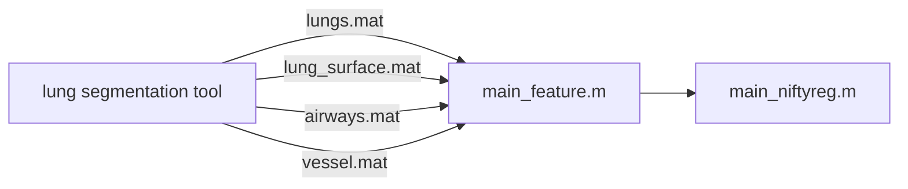

# Feature-based NiftyReg

By utilizing lung masks, airway masks, and vesselness masks, we apply distance transforms to the lungs and airways to create gradient-enhanced mask boundaries. Ultimately, we employ the distance-transformed lung mask, the distance-transformed airway mask, and the vesselness mask for the purpose of registration.

# Folder Structure
- data
  - case1
    - 20110224
      - dicom
      - mask
    - 20110526
      - dicom
      - mask
  - case2
    - 20110525
      - dicom
      - mask
    - 20110926
      - dicom
      - mask

##  Flow Chart

## Feature Demo

 1. masked lungs mask distance tranceform

2. masked airways mask distance tranceform

3. 4D feature

## Reference
[1] A. Stavropoulou et al., “A multichannel feature-based approach for longitudinal lung CT registration in the presence of radiation induced lung damage,” Physics in Medicine &amp;amp; Biology, vol. 66, no. 17, p. 175020, 2021. doi:10.1088/1361-6560/ac1b1d 