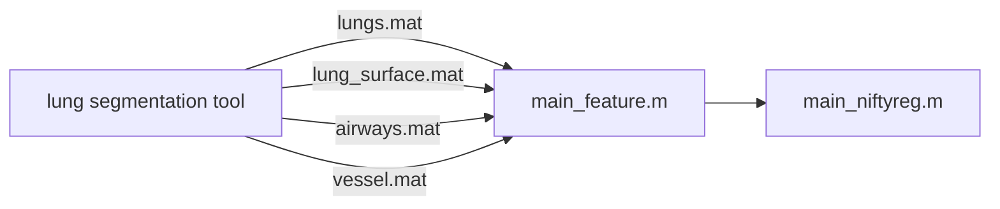

# Lung CT Registration

Implementation of lung CT registration based on the paper [A multichannel feature-based approach for longitudinal lung CT registration in the presence of radiation induced lung damage.](https://iopscience.iop.org/article/10.1088/1361-6560/ac1b1d) This codebase utilizes the [Pulmonary Toolkit](https://github.com/tomdoel/pulmonarytoolkit) and [NiftyReg](http://cmictig.cs.ucl.ac.uk/wiki/index.php/NiftyReg) for image processing and registration.

## Prerequisites

Before you begin, ensure you have met the following requirements:
- MATLAB (version R2022a or higher recommended)
- [Pulmonary Toolkit](https://github.com/tomdoel/pulmonarytoolkit) installed
- [NiftyReg](http://cmictig.cs.ucl.ac.uk/wiki/index.php/NiftyReg) installed and available in your system's PATH

## Installation

Clone the repository using Git:

```bash
git clone https://github.com/chenyu-chang/NiftyReg_lung.git
```

## Data Structure

Organize your DICOM and mask data as follows:

```
data/
├─case1/
│  ├─20110224/
│  │  ├─dicom/
│  │  └─mask/
│  └─20110526/
│      ├─dicom/
│      └─mask/
└─case2/
    ├─20110525/
    │  ├─dicom/
    │  └─mask/
    └─20110926/
        ├─dicom/
        └─mask/
```
##  Flow Chart


## Usage

Modify the path variables in the MATLAB script to point to your DICOM and mask directories. Once set up, run the script in MATLAB. The process is divided into the following stages:

1. DICOM stacking
2. Distance transforms for lungs and airways
3. Binary masking for vessels
4. Feature saving
5. Image registration using NiftyReg tools
6. Visualization of registration results


## Registration Workflow

The script will:
- Load and process DICOM images and masks for the reference (`ref`) and floating (`flo`) time points.
- Perform image registration using features extracted from the DICOM images.
- Save the registered images and transformation matrices.
- Perform the registration to the floating images.
- Display the registration results for validation.

## Functions

Included custom MATLAB functions:
- `list_folder(path)`: Utility function to list folders.
- `masked_distance_transform(mask, surface)`: Applies a distance transform to the provided mask and surface.


## Feature Demo

 1. masked lungs mask distance tranceform


2. masked airways mask distance tranceform


3. 4D feature


## Reference
[1] A. Stavropoulou et al., “A multichannel feature-based approach for longitudinal lung CT registration in the presence of radiation induced lung damage,” Physics in Medicine &amp;amp; Biology, vol. 66, no. 17, p. 175020, 2021. doi:10.1088/1361-6560/ac1b1d 
